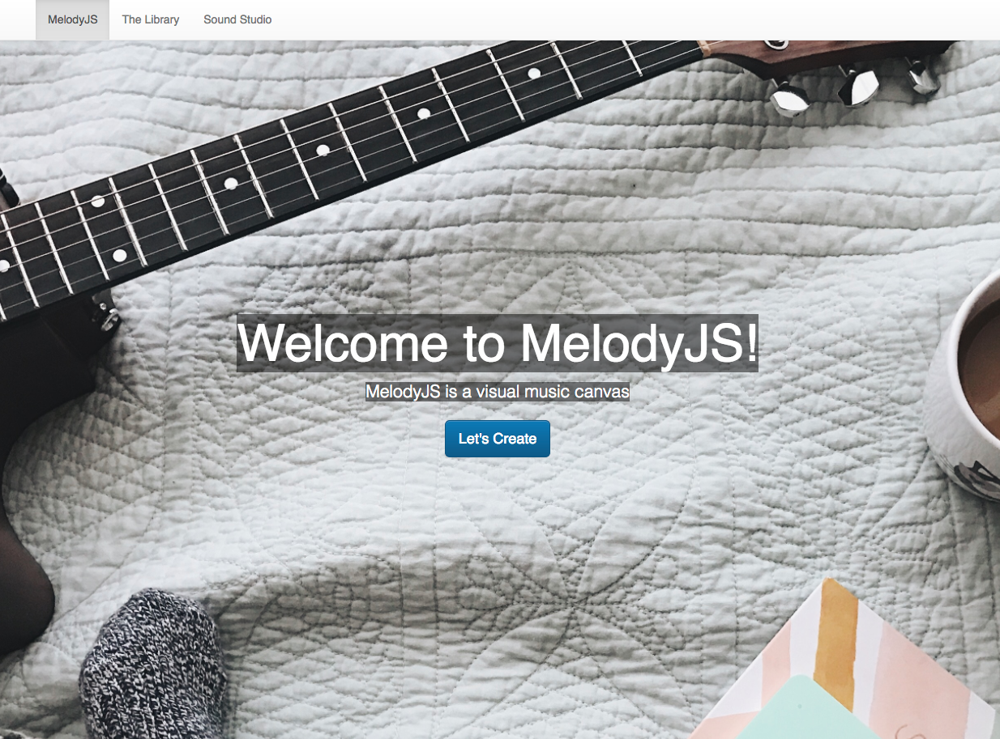

# MelodyJS README: http://melodyjs.surge.sh/

 

## About MelodyJS:

This project explores the **ToneJS** library, the **ReactJS** framework, **bootstrap** and vanilla JavaScript to create an interactive and visual tool to create music.

Some tools employed include **react-bootstrap**, **Jest** & **enzyme** for unit testing and mock api calls, **redux** state management, **react-thunks middleware** for async functions, and *storybook** for component based development.  

## Inspiration:

MelodyJS was inspired by the ToneJS library (hence the name, MelodyJS) and this video on YouTube where a musician created an image that both looked like an unicorn and sounded amazing:

### Future Enhancements:
- Multiple instruments for playback
- Visualize music using C3/D3 to show as music previews
- Create and save instrument entities
- Edit songs (mixer/note lengths instead of changing notes)
- Map notes to keyboard
- Make a mobile compatible app (ReactNative)
